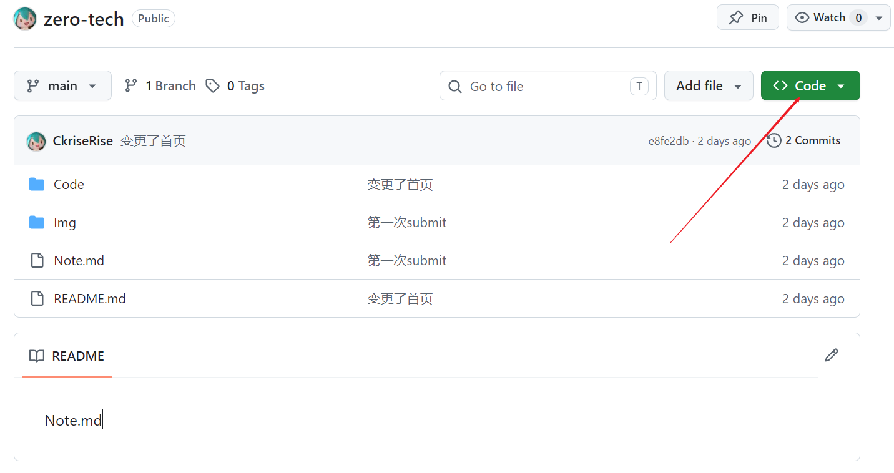
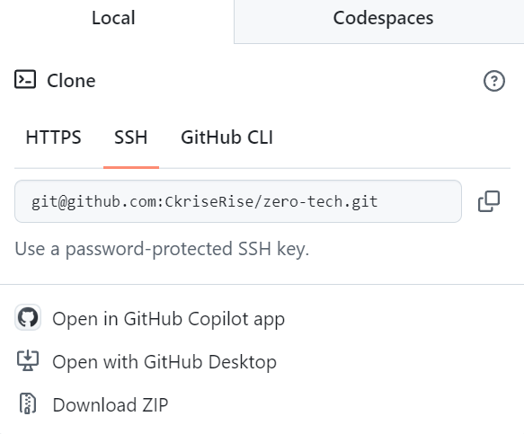

# 0-全栈

## 终端

### 文件与目录操作（最常用）

| 命令           | 说明                         | 示例                          |
| -------------- | ---------------------------- | ----------------------------- |
| `dir`          | 显示当前目录下的文件和子目录 | `dir /w` 宽格式显示           |
| `cd` / `chdir` | 切换目录                     | `cd C:\Users\user\Desktop`    |
| `md` / `mkdir` | 创建新目录                   | `mkdir myfolder`              |
| `del`          | 删除文件                     | `del test.txt`                |
| `rd` / `rmdir` | 删除目录                     | `rmdir /s myfolder`（含子项） |
| `copy`         | 复制文件                     | `copy a.txt d:\backup\a.txt`  |
| `xcopy`        | 高级复制（支持目录）         | `xcopy mydir d:\backup /E /I` |
| `move`         | 移动/重命名文件或目录        | `move a.txt d:\backup\`       |
| `type`         | 显示文件内容                 | `type readme.txt`             |
| `cls`          | 清屏                         | `cls`                         |

------

### 系统管理命令

| 命令         | 说明                       | 示例                              |
| ------------ | -------------------------- | --------------------------------- |
| `tasklist`   | 显示当前运行的进程列表     | `tasklist`                        |
| `taskkill`   | 终止进程                   | `taskkill /IM notepad.exe /F`     |
| `systeminfo` | 显示系统信息               | `systeminfo`                      |
| `hostname`   | 显示计算机名               | `hostname`                        |
| `set`        | 查看/设置环境变量          | `set JAVA_HOME=C:\Java`           |
| `echo`       | 输出文本或变量             | `echo Hello World`，`echo %PATH%` |
| `pause`      | 暂停脚本执行，按任意键继续 | `pause`                           |
| `exit`       | 退出命令行或脚本           | `exit`                            |

------

### 磁盘与文件系统工具

| 命令       | 说明               | 示例                       |
| ---------- | ------------------ | -------------------------- |
| `chkdsk`   | 检查磁盘错误       | `chkdsk C:`                |
| `diskpart` | 启动磁盘分区工具   | `diskpart`（进入交互模式） |
| `format`   | 格式化磁盘         | `format E: /FS:NTFS`       |
| `label`    | 查看或更改磁盘标签 | `label E:`                 |

------

### 网络命令（排障必备）

| 命令       | 说明             | 示例                       |
| ---------- | ---------------- | -------------------------- |
| `ipconfig` | 显示本机 IP 配置 | `ipconfig /all`            |
| `ping`     | 测试网络连接     | `ping www.baidu.com`       |
| `tracert`  | 路由跟踪         | `tracert www.google.com`   |
| `netstat`  | 查看端口/连接    | `netstat -an`              |
| `nslookup` | DNS 查询         | `nslookup www.baidu.com`   |
| `netsh`    | 网络配置工具     | `netsh wlan show profiles` |
| `ftp`      | FTP 客户端       | `ftp ftp.example.com`      |

------

### 用户与权限

| 命令       | 说明                   | 示例                                                |
| ---------- | ---------------------- | --------------------------------------------------- |
| `net user` | 用户管理               | `net user` 查看用户；`net user user1 /add` 添加用户 |
| `runas`    | 以其他用户身份运行程序 | `runas /user:Administrator cmd`                     |
| `whoami`   | 显示当前登录用户       | `whoami`                                            |
| `attrib`   | 修改文件属性           | `attrib +r file.txt`（设为只读）                    |

## 浏览器

如果一台电脑愿意持续对外**提供**内容，**接收**请求，**返回**结果，那么在这个语境下，它通常叫做：服务器

而这台联网的电脑的地址就是：

> IP 地址

我们可以将他理解成：一台联网设备在网络中的地址

但是由于 IP 是一长串数字，对人来说不好记忆

所以就有了：

> 域名

比如

- baidu.com
- github.com

域名的作用即：

> 给机器地址起一个更方便记忆和输入的名字

然而，我们输入的是域名，但是浏览器要找到是 IP 地址，那么中间负责转换是：

>DNS

即：

> 一个把域名翻译成 IP 地址的系统

最后，由于一台服务器不一定只跑一个服务

比如同一台服务器上，可能同时有好几个不同的服务在运行，就好像我们自己的电脑也可以刷视频的同时玩原神。

所以浏览器还要继续确认一件事：

> 我们这次到底要连接这台电脑上的哪一个服务

这里就要引出另一个词：

> 端口

什么是端口？

> 同一台电脑上，不同电脑服务的不同入口。

服务器在同一个 IP 地址上可以开启多个端口

浏览器找到服务器以后，也需要知道

> 需要连接的端口号，才能拿到网页内容

常用的端口：

- 80：常常和普通网页访问有关
- 443：常常和 HTTPS 加密访问有关

>所以当我们在浏览器输入一个网址并按下回车时：
>
>大致流程为：
>
>1. 你在浏览器输入一个域名
>2. 浏览器先去查这个域名对应的 IP 地址
>3. DNS 把这个域名对应的 IP 地址告诉浏览器
>4. 浏览器根据 IP 地址找到那台服务器
>5. 浏览器在通过端口访问这台服务器的对应服务
>6. 服务器把网页内容返回给浏览器
>7. 浏览器把这些内容显示成你看到的内容

## 服务器

服务器和我们本地的电脑的不同之处：

**不同 1：服务器拥有真正的公网 IP**

我们用自己的电脑连上 WIFI，此时我们的电脑拿到的是路由器分配的一个内网地址，比如 `192.168.1.5`。就好像一个电话的内网号码，互联网上的其他人是找不到这个地址的。

> 这里可能会有一个疑问：既然别人找不到我的内网地址，如果我电脑上登录了微信，微信消息是怎么送到我电脑上的？
>
> 关键在于，谁先发起了连接。
>
> 你感觉自己“只是开着电脑连着网”，但微信 App 已经默默做了一件事：它一启动，就主动连接了微信的服务器，并且一直保持着这条连接不断开。
>
> 所以当朋友发消息给你，消息先到了微信的服务器，然后微信服务器顺着那条已经建好的连接把消息推过来，最终传给了你的电脑。
>
> 你体验到的是“消息自动弹出来了”，但背后的结构是：**你的微信 APP 主动连出去在先，服务器沿着这条通道推消息在后**。
>
> 但如果换一个场景：有人想直接“找到你的电脑”，在没有任何已有连接的情况下主动向你发起请求，这就行不通了。因为外面的人最多只知道你路由器的公网 IP，不知道你家里有几台设备，更不知道该把请求转给哪一台。

这就是内网 IP 和公网 IP最关键的区别：

> 内网 IP 只能“主动出去”，不能”被陌生人主动找到“。而公网 IP 两个方向都通。

网站需要的恰恰是后者，任何人在任何时候都能主动找到它。所以服务器必须有公网 IP。 

不同 2：服务器不需要屏幕，鼠标或键盘

虽然服务器作为电脑，当然可以外接任何外设，但是人们通常不会给服务器配置这些

因为服务器在绝大多数时间内只需要保持开机联网，并稳定向请求者持续提供服务。人们对它的要求是稳定、方便摆放在机架上。

没有显示器，也没有键盘鼠标，我们如何操控服务器呢？

我们自然可以走进机房，给它插上显示器、键盘来操作它，但更多时候我们操控服务器的方式，是通过网络远程登录进去，用终端和命令来操作。

### 连接服务器

~~~cmd
ssh root@IP地址
-输入密码
~~~

## Nginx

### 用 apt 在服务器上安装 Nginx

如果想要让服务器提供网页服务，我们还需要安装一个软件，这个软件的职责将会是：

- 持续监听 80 端口
- 如果有用户请求 80 端口，那么就返回相应的内容

有许多软件可以做这类事情，而今天我们介绍的是 Nginx，它非常擅长处理这类工作。

> Nginx 能够做到的事情绝不止有监听端口并返回内容，它可以做许多事情。比如它可以记录每一次用户请求日志、给用户请求分类并分别处理、限制危险请求等。你了解即可，我们不做展开。

接下来，进入安装环节。

先更新软件包列表，再安装 Nginx：

```bash
sudo apt update
# apt:就像服务器上的应用商店，使用 apt 可以下载各种应用，该步骤是更新应用商店
# sudo，关键字，告诉服务器用 root 权限安装
# 执行敏感性命令时使用 sudo
sudo apt install nginx -y
# -y:遇到 yes or no 时 一律 yes
```

> 以 `sudo` 开头的命令在执行的时候，会要求你提供密码，这个密码就是你登录的时候用的密码。

这里两个新命令：

- `sudo`：以更高权限执行命令（类似 Windows 上的“以管理员身份运行”）
- `apt`：Ubuntu 上的软件安装工具，类似 macOS 上的 Homebrew

安装完成后，确认 Nginx 已经在运行：

```bash
systemctl status nginx
```

如果看到输出里有这一行：

```text
Active: active (running)
```

说明 Nginx 已经启动，正持续监听用户请求。

**确认 80 端口开放，用 IP 地址访问默认页面**

Nginx 启动后，它默认监听的是 **80 端口**，也就是普通 HTTP 请求的标准端口。

所以在我们从浏览器访问它之前，还需要确认一件事：

> 云服务器的防火墙（或安全组）有没有放行 80 端口的入站流量。

这个设置不在服务器里，而在云平台的控制台里。

> 还记得前面学习 SSH 的时候，我们在哪里去查看 22 端口是否开放吗？

在云平台找到你的服务器实例，进入安全组或防火墙配置，确认 TCP 80 端口是对外开放的。

做好之后，打开你自己电脑上的浏览器，访问下面这个地址，应该就可以看到 Nginx 的默认欢迎页：

```text
http://你的服务器公网IP
```

如果看到 Nginx 的默认欢迎页面，说明：

- Nginx 正在运行
- 80 端口已经开放
- 你的浏览器正在通过公网 IP 访问另一台电脑上提供的网页内容

上一节讲的整条链路，在这里第一次真实地发生了：

> 浏览器 → IP 地址 → 服务器 → 80 端口 → Nginx → 返回页面内容 → 浏览器显示

### 通过配置文件找到 Nginx 的默认页面

上一步我们访问到的浏览器里那个 Nginx 默认页面，背后也是对应着服务器上的一个 HTML 文件。

但这个文件放在哪里？

不用猜，去看 Nginx 的配置文件：

```bash
cat /etc/nginx/sites-available/default
```

终端会打印出一大段配置。不需要全看懂，只需要找到这一行：

```text
root /var/www/html;
```

这行配置的意思就是：

> Nginx 会去 `/var/www/html` 这个目录里找网页文件来提供给浏览器。

顺着这个路径，进去看看：

```bash
cd /var/www/html
ls
```

你会看到一个文件，通常叫：

```text
index.nginx-debian.html
```

这就是刚才浏览器里默认页面对应的源文件。

用 `cat` 看一眼它的内容：

```bash
cat index.nginx-debian.html
```

终端会打印出一大段 HTML。你不需要看懂它，只需要确认一件事：

> 浏览器里的那个网页，背后真的对应着服务器上的一个 HTML 文件。

文件在哪里、内容是什么，全都可以找到、可以查看，服务器不是黑盒。

用 Vim 修改这个文件，刷新浏览器看变化

既然这个网页就是一个真实存在的 HTML 文件，那么我们稍微改一改，起步就是改了这个网页吗？

没错，现在我们尝试亲手改一次这个文件，在浏览器里验证结果。

上一节学过生存级 Vim，现在就用上了：

```bash
sudo vim /var/www/html/index.nginx-debian.html
```

进去之后：

1. 按 `i` 进入编辑模式
2. 找到页面里最显眼的一行英文，改成任意一句你自己写的话
3. 按 `Esc` 退出编辑模式
4. 输入 `:wq` 保存并退出
5. 按回车

改完后，回到浏览器，刷新页面。

如果你看到了自己刚才写的那句话，这一节就真正完成了。

你刚刚走完的，是这样一条完整的链路：

1. SSH 登录远程服务器
2. 找到 Nginx 配置，顺着 `root` 路径找到页面源文件
3. 用 Vim 修改文件内容
4. Nginx 继续对外提供这个文件
5. 浏览器刷新，公网页面内容发生了变化

## Git

~~~cmd
#1.确认 Git 已安装
git --version

#2.配置提交身份（每台电脑一次）
#先检查是否已配置：
git config --global user.name
git config --global user.email
#如果未配置，执行：
git config --global user.name "你的名字"
git config --global user.email "你的邮箱"

#3.初始化仓库
#进入项目目录并初始化：
cd ~/zero-to-tech
git init
#然后查看状态：
git status

#4.先配置忽略规则（.gitignore）
#在项目根目录新建 .gitignore，写入需要git忽视追踪的文件
#这里有个关键点：
#.gitignore 本身应该提交（它是项目规则）
#.git 不需要写进 .gitignore（Git 会自动管理）

#5.提交
#加入至暂存区
git add 文件名
#全部加入至暂存区
git add .

#执行提交
git commit -m "第一次提交"

#6.查看提交日志
git log
git log --oneline

#7.回退版本
git checkout 版本编号

#如果文件已经被追踪，即使你将它写入 .gitignore 文件里，也会继续被追踪，除非执行
git rm --cached Note.md

~~~

###本地或者服务器连接github

>~~~cmd
>#1.生成密钥
>ssh-keygen -t ed25519 -C "邮箱"
>#2.查看密钥
>cd .ssh/
>ls
>#返回
>authorized_keys  id_ed25519  id_ed25519.pub
>#查看
>cat id_ed25519.pub
>#连接github
>ssh -T git@github.com
>~~~

### 克隆项目





选择合适的方式克隆

~~~cmd
#第一次拉取项目用 clone，后续拉取用 pull
git clone@github.com:CkriseRise/zero-tech.git
~~~

